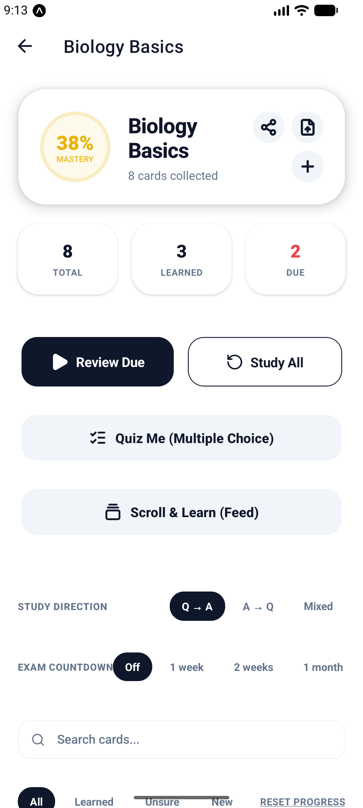
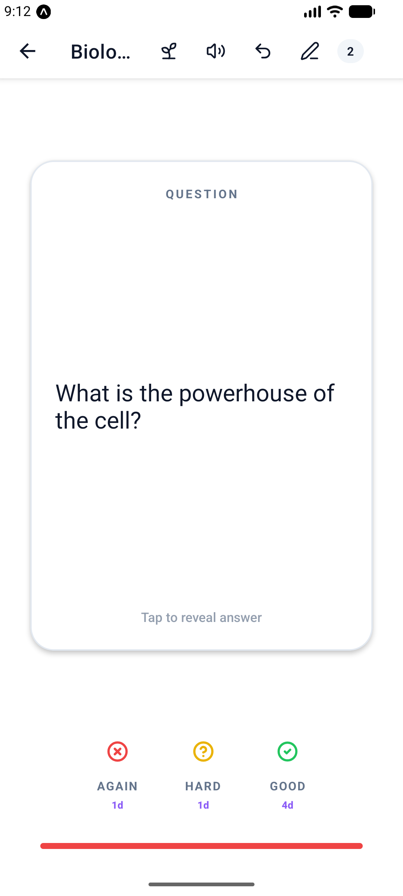

<div align="center">


# Sprig

**Turn any CSV into flashcards.**

A calm, offline-first study app for Android. Import a `question,answer` file and it
becomes a spaced-repetition deck — swipe through cards, quiz yourself, and grow a
plant while you focus.


<br>

&nbsp;&nbsp;&nbsp;&nbsp;


</div>

<br>

## Features

- **Swipe, quiz, type or scroll** — four study modes, scheduled by SM-2 spaced repetition
- **Focus garden** — a plant grows while you study and wilts if you leave; ambient sounds included
- **PDFs & audio** — your textbooks and lectures next to your decks, with WiFi drop from your computer
- **Anki import & images** — bring .apkg decks along, attach images to any card
- **Streaks, XP & achievements** — progress that keeps you coming back
- **Private by design** — no account, no servers, everything stays on your device

## Development

```bash
npm install
npx expo start
```

Built with [Expo](https://expo.dev) SDK 54. Production builds via
`npx eas-cli build --platform android --profile production`.

## Support

<a href="https://buymeacoffee.com/mousewerk">
  
</a>

---

<div align="center">

**[Landing page](https://mousewerk.github.io/Sprig/)** · **[Privacy policy](https://mousewerk.de/sprig/privacy)**

Sounds by [Moodist](https://github.com/remvze/moodist) (CC0) · Icons by [Lucide](https://lucide.dev)

© 2026 Mousewerk

</div>
