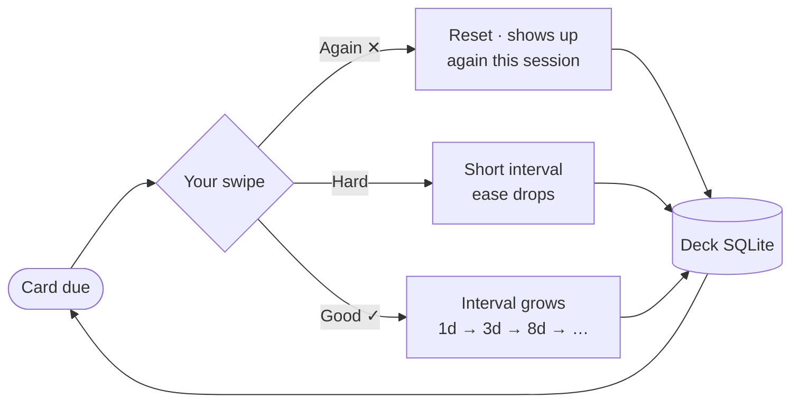

<div align="center">


# Sprig

**Turn any CSV into flashcards.**

A calm, offline-first study app for Android. Import a `question,answer` file and it becomes a
spaced-repetition deck — swipe through cards, quiz yourself, and grow a plant while you focus.


<br>

<a href="https://buymeacoffee.com/mousewerk">
  
</a>

<br><br>

&nbsp;&nbsp;&nbsp;&nbsp;


</div>

<br>

## Why Sprig?

Your notes are already flashcards — they're just trapped in a spreadsheet. Sprig's whole
import format is one row per card:

```csv
question,answer
What is the powerhouse of the cell?,The mitochondria
photosynthesis,light → glucose + oxygen
le chien,the dog
```

Export it from Excel or Google Sheets, paste it straight from your clipboard, bring an
**Anki deck**, or let any AI generate one. Pick the file in Sprig and start studying —
the CSV stays the source of truth.

<br>

## Features

<table>
<tr>
<td width="50%" valign="top">

### Study your way

| Mode | What it does |
|---|---|
| **Swipe** | Grade each card with a swipe; SM-2 spaced repetition schedules the next review |
| **Quiz** | Multiple choice, distractors drawn from your own deck |
| **Type** | Type the answer — fuzzy matching forgives typos |
| **Feed** | Scroll cards like a social feed, highlight key words with the pen |
| **Today** | One tap queues due cards, exam prep and tricky cards across all decks |

</td>
<td width="50%" valign="top">

### Focus garden

A plant grows for every focused minute and **wilts if you leave the app** for more
than 10 seconds. Pomodoro-style sessions with earned breaks, an ambient sound
mixer (rain, campfire, ocean, …) and the same plant keeping you company on the
study screens.

### Progress that sticks

XP and levels, daily goals, streaks with **streak freezes**, 23 achievements,
a review heatmap — and per-deck **exam countdowns** that pace your reviews so
you finish the deck before the date.

</td>
</tr>
<tr>
<td valign="top">

### Everything in one place

- **PDF library** — reopens exactly where you stopped, jump & zoom
- **Audio library** — lectures with resume, speed control and lock-screen controls
- **WiFi drop** — start the upload server and drag files from your computer's browser straight onto the phone

</td>
<td valign="top">

### Private by design

No servers, no account, no analytics. Everything lives in a local SQLite
database on your device — with full **backup & restore** to a single file
you own.

</td>
</tr>
</table>

<br>

## How reviews are scheduled

Every swipe feeds the SM-2 algorithm — hard cards come back sooner, easy ones stay out of your way:



Cards you keep confusing with each other are detected and offered as a dedicated
**Tricky Cards drill**.

<br>

## Getting cards in

| Source | How |
|---|---|
| **CSV / TSV / text file** | `Home → + → Import from CSV` — comma, tab or line separated |
| **Paste from clipboard** | `Home → + → Paste Cards as Text` — one card per line |
| **Anki deck (.apkg)** | `Home → + → Import Anki Deck` — cards, cloze notes **and images** come along |
| **Images on cards** | Attach images to question or answer in the card editor — tap any image while studying for a full-screen view |
| **Open with Sprig** | Share a CSV or PDF from any app and Sprig imports it |
| **Built by hand** | Create an empty deck and add cards in the editor |

<br>

## Development

Sprig is an [Expo](https://expo.dev) app (SDK 54, expo-router, React Compiler, new architecture).

```bash
npm install
npx expo start          # dev server — press "a" for the Android emulator
```

```bash
npx eas-cli build --platform android --profile production   # store build
```

| Path | What lives there |
|---|---|
| `app/` | expo-router screens (tabs, study modes, focus, editors) |
| `components/` | shared UI — cards, growing plant, sound mixer, bottom sheets |
| `utils/` | SQLite storage, SM-2, Anki import, fuzzy matching, web upload server |
| `docs/` | landing page + privacy policy, served via GitHub Pages |

> **Note:** the audio player, PDF viewer and WiFi upload use native modules —
> use a dev build (`npx expo run:android`), not Expo Go, to test everything.

<br>

## Support

If Sprig helps you study, you can support development here:

<a href="https://buymeacoffee.com/mousewerk">
  
</a>

<br>

## Credits

Ambient sound loops come from the open-source [Moodist](https://github.com/remvze/moodist)
project (Pixabay Content License / CC0). Icons are [Lucide](https://lucide.dev). Full
credits are listed in the app under **Settings → Credits & Licenses**.

---

<div align="center">

**[Landing page](https://mousewerk.github.io/Sprig/)** · **[Privacy policy](https://mousewerk.de/sprig/privacy)** · **[Buy me a coffee](https://buymeacoffee.com/mousewerk)**

© 2026 Mousewerk · Sprig logo and name are © Mousewerk

</div>
